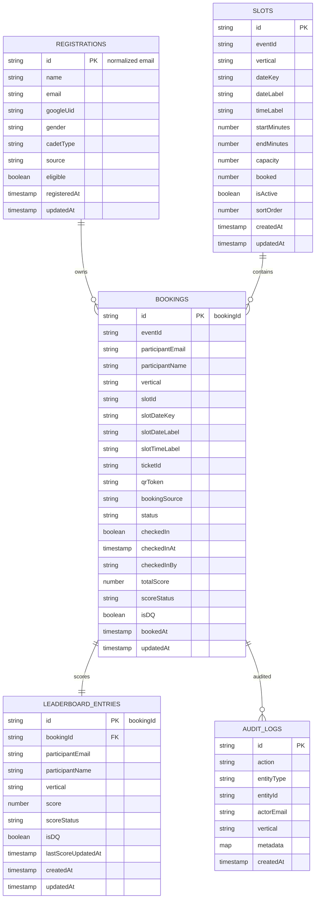

# Lakshya 2.0 — Revised Firestore Database Schema

## 1. Purpose

This schema replaces the earlier model that stores a single `category`, `slotId`, `ticketId`, QR token, attendance state and score directly on one participant record.

The earlier model is insufficient for Lakshya 2.0 because one person may book **both** Air Rifle and Air Pistol. The correct model separates person/registration identity from each vertical-specific booking.

## 2. Firestore namespace

Continue using the existing project namespace:

```text
/artifacts/{appId}/public/data/{collectionName}/{documentId}
```

Recommended collections:

1. `registrations`
2. `slots`
3. `bookings`
4. `leaderboard_entries`
5. `audit_logs`
6. `app_config`

Optional/supporting collection:
7. `admins`

---

# 3. Entity model



## 4. `registrations`

One document per registered event participant.

### Document ID

```text
normalizeEmail(email)
```

Example:
```text
alex.kumar@example.com
```

### Fields

| Field | Type | Required | Notes |
|---|---|---:|---|
| `id` | string | yes | Same as normalized email |
| `name` | string | yes | Imported/directly registered full name |
| `email` | string | yes | Lowercase canonical email |
| `googleUid` | string/null | no | Filled after successful Google login |
| `gender` | string | no | Preserve registration data if collected |
| `cadetType` | string | no | Preserve existing terminology |
| `source` | string | yes | `google_form` / `manual` / `imported` |
| `eligible` | boolean | yes | Whether this registration may book |
| `registeredAt` | timestamp | yes | Event registration timestamp |
| `updatedAt` | timestamp | yes | Last record update |

### Booking invariant
A registration may own 0–2 bookings:
- maximum 1 `Air Rifle`
- maximum 1 `Air Pistol`

---

# 5. `slots`

One document per date/time/vertical firing slot.

### Suggested document ID

```text
{eventId}_{dateKey}_{vertical}_{startMinutes}
```

Example:
```text
lakshya-2.0_2026-09-26_air-rifle_480
```

### Fields

| Field | Type | Required | Notes |
|---|---|---:|---|
| `id` | string | yes | Same as document ID |
| `eventId` | string | yes | `lakshya-2.0` |
| `vertical` | string | yes | `Air Rifle` / `Air Pistol` |
| `dateKey` | string | yes | ISO date `YYYY-MM-DD` |
| `dateLabel` | string | yes | Display label, e.g. `26 September 2026` |
| `timeLabel` | string | yes | e.g. `08:00 - 09:00 HRS` |
| `startMinutes` | number | yes | Minutes from midnight |
| `endMinutes` | number | yes | Minutes from midnight |
| `capacity` | number | yes | Default Air Rifle 18 / Air Pistol 6 |
| `booked` | number | yes | Atomically maintained count |
| `isActive` | boolean | yes | Disabled slots cannot be booked |
| `sortOrder` | number | yes | Chronological sort key |
| `createdAt` | timestamp | yes | Audit |
| `updatedAt` | timestamp | yes | Audit |

### Capacity invariant
```text
0 <= booked <= capacity
```

---

# 6. `bookings`

This is the operational source of truth for each vertical-specific pass.

### Document ID

Use a generated booking ID, for example:
```text
bk_01J...
```

Do NOT use email as the booking document ID, because a single user may have two bookings.

### Fields

| Field | Type | Required | Notes |
|---|---|---:|---|
| `id` | string | yes | Booking document ID |
| `eventId` | string | yes | Event identifier |
| `participantEmail` | string | yes | Lowercase registered email |
| `participantName` | string | yes | Snapshot from registration |
| `vertical` | string | yes | `Air Rifle` / `Air Pistol` |
| `slotId` | string | yes | References `slots` |
| `slotDateKey` | string | yes | Snapshot of slot date |
| `slotDateLabel` | string | yes | Snapshot for ticket/report |
| `slotTimeLabel` | string | yes | Snapshot for ticket/report |
| `ticketId` | string | yes | `TKT-[A-F0-9]{6}` |
| `qrToken` | string | yes | Opaque cryptographically random token |
| `bookingSource` | string | yes | `self` / `admin` |
| `status` | string | yes | `confirmed` / `cancelled` / `completed` |
| `checkedIn` | boolean | yes | Default `false` |
| `checkedInAt` | timestamp/null | yes | Default null |
| `checkedInBy` | string/null | yes | Admin email/UID |
| `totalScore` | number/null | yes | 0–10 for current event UI, null before scoring |
| `scoreStatus` | string | yes | `pending` / `published` / `final` |
| `isDQ` | boolean | yes | Default false |
| `bookedAt` | timestamp | yes | Booking time |
| `updatedAt` | timestamp | yes | Last update |

### Uniqueness rule
A user may create at most one booking per vertical for the event.

Recommended deterministic uniqueness key:
```text
{eventId}_{normalizedEmail}_{verticalSlug}
```

Store that key in a unique-helper document/collection if your backend uses a generated booking ID.

Alternative: make this deterministic key the booking ID. This is often the simplest option:
```text
lakshya-2.0_alex.kumar@example.com_air_rifle
lakshya-2.0_alex.kumar@example.com_air_pistol
```

This is the recommended approach because Firestore then enforces the one-per-vertical invariant through document existence.

---

# 7. `leaderboard_entries`

One document per booking.

### Document ID

Recommended:
```text
bookingId
```

### Fields

| Field | Type | Required | Notes |
|---|---|---:|---|
| `id` | string | yes | Same as bookingId |
| `bookingId` | string | yes | Booking reference |
| `participantEmail` | string | yes | Lowercase email |
| `participantName` | string | yes | Display name |
| `vertical` | string | yes | Independent Rifle/Pistol ranking |
| `score` | number/null | yes | Current live score |
| `scoreStatus` | string | yes | `pending` / `published` / `final` |
| `isDQ` | boolean | yes | Disqualified entries excluded from normal ranking |
| `lastScoreUpdatedAt` | timestamp/null | yes | Tie-break support |
| `createdAt` | timestamp | yes | Audit |
| `updatedAt` | timestamp | yes | Audit |

### Ranking

Default rank query:
1. `vertical == selectedVertical`
2. exclude `isDQ == true` for ranked display
3. `scoreStatus in {published, final}`
4. order by `score desc`
5. tie-break using configured deterministic rule

---

# 8. `audit_logs`

Operational history for accountability.

### Actions to log

- `BOOKING_CREATED`
- `BOOKING_CANCELLED`
- `BOOKING_REASSIGNED`
- `MANUAL_ALLOCATION`
- `CHECK_IN`
- `CHECK_IN_DUPLICATE_ATTEMPT`
- `SCORE_CREATED`
- `SCORE_UPDATED`
- `DQ_MARKED`
- `SLOT_CREATED`
- `SLOT_UPDATED`
- `REGISTRATION_UPDATED`

### Fields

| Field | Type | Required |
|---|---|---:|
| `id` | string | yes |
| `action` | string | yes |
| `entityType` | string | yes |
| `entityId` | string | yes |
| `actorEmail` | string | yes |
| `vertical` | string/null | no |
| `metadata` | map | no |
| `createdAt` | timestamp | yes |

---

# 9. `app_config`

Small event-level configuration document.

Suggested document:
```text
app_config/lakshya-2.0
```

Suggested fields:

```json
{
  "eventId": "lakshya-2.0",
  "eventName": "Lakshya 2.0",
  "registrationFormUrl": "https://forms.google.com/...",
  "airRifleCapacityDefault": 18,
  "airPistolCapacityDefault": 6,
  "scoreMin": 0,
  "scoreMax": 10,
  "bookingOpen": true,
  "leaderboardLive": true
}
```

Do not store secrets here.

---

# 10. Admin identities

The earlier project schema explicitly lists verified admin email addresses in its rules. Preserve the existing verified identities in the deployed project unless the project owner intentionally changes them.

Admin email verification should be enforced by Firestore rules / trusted backend, not only a frontend route guard.

---

# 11. Booking transaction

The booking transaction should atomically:

1. verify authenticated user's email
2. read registration
3. require `eligible == true`
4. verify slot exists and is active
5. verify requested vertical matches slot vertical
6. read deterministic booking ID
7. reject if booking already exists for that vertical
8. verify `booked < capacity`
9. create booking
10. create/update leaderboard entry with pending score
11. increment slot `booked`
12. create audit log where trusted backend is available

For reallocation/cancellation the same transaction model applies in reverse.

---

# 12. QR security

Never trust a scanned QR's name/email alone.

Recommended QR token properties:
- random
- unique per booking
- sufficiently long
- non-derivable from email
- not reused after cancellation/reissue

The scanner should treat `bookingId + ticketId + qrToken` as an assertion that still must be verified against Firestore.

---

# 13. Reports supported by the model

The schema directly supports:
- all slots + participants per slot
- registered but unbooked
- occupancy by slot
- attendance lists
- Air Rifle leaderboard
- Air Pistol leaderboard
- audit trail
